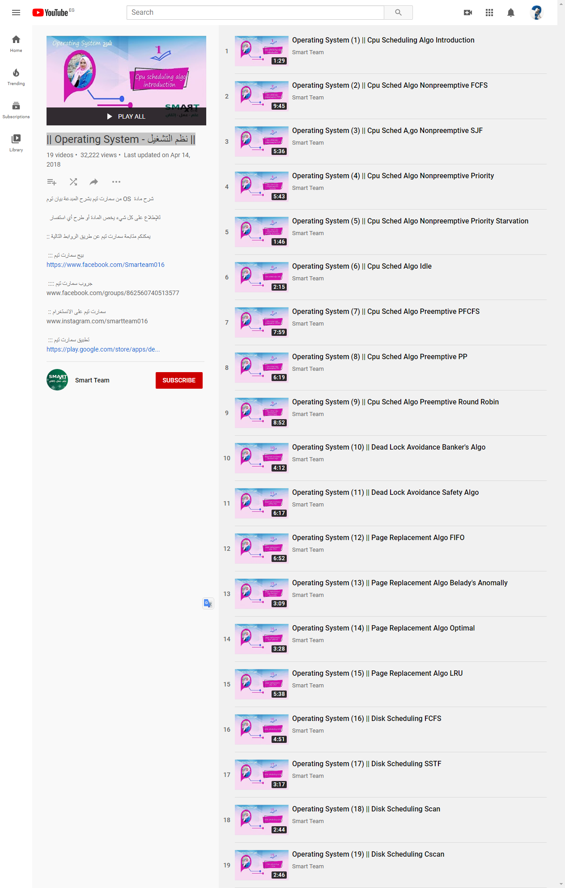

OS
====

Operating System

- Computer Architecture
- Computer Organization
- File Organization
- Computer System

## Referance

> Computer Operating System Concepts
    - Edition
    - Publisher
    - Author
    - ISBN
> Operating Systems: Internals & Design Principles 7th Ed, William Stallings.

# Deifications
- system: a collection of components integrated with each other to do specific task.
- OS: intermediate layer between hardware and application program.

- sys calls:
types:
- Processes Management
- File Management
- Device Management
- Communication syscalls
- Information syscalls

Draft

GENERAL NOTE
Hidden Slides are Extra
Knowledge
Not Included in Exams

[Introduction to Operating Systems](https://www.udacity.com/course/introduction-to-operating-systems--ud923)
byGeorgia Institute of Technology
Offered at Georgia Tech as CS 8803

## About this Course

This course teaches the basic operating system abstractions, mechanisms, and their implementations.

The core of the course contains:
- concurrent programming
    - threads
    - synchronization
- inter process communication
- introduction to distributed operating systems

The course is split into four sections:
1. Introduction
2. Process and Thread Management
3. Resource Management and Communication
4. Distributed Systems

------------------------------------------------------------------------------------------------------------------------------------------
[Introduction to Operating Systems - udacity ud923](https://udacity.com/courses/ud923)
===

## visual metaphor to describe what a process is.

- toy shop as an example,
- you can think of a process as an order of toys.

An order of toys has its:
    - state of execution
        - include the completed toys
        - the toys that are waiting to be built
    - it requires some parts, and a temporary holding area
    - require some special hardware.

For instance:
    state of execution, may , that are part of that order, and other things.
Building the toys may require various parts, like plastic pieces, wooden pieces,
and these come in different containers, or
we may require some other temporary holding area for the pieces.
And, finally, to actually build a toy, we may need some special hardware.
We may need sewing machines, glue guns, or other types of tools.
So, how does all of this then compare to a process in an operating system?
Well, a process also has a state of execution described with
the program counter, the stack pointer.
All this information is used by the operating system to decide how
to schedule the process, how to swap between multiple processes, and
for other management tasks.
In order to execute, the process needs some data.
There's some state in registers.
And, it also has some temporary holding area.
For instance, it occupies state in memory.
Finally, executing a process may require some special hardware like
I/O devices like discs, or network devices.
The operating system has to manage these devices and
control which of the processes that are perhaps executing concurrently at
the same time gets access to which hardware components.
This is similar to what would happen in a toy shop where the toy shop
manager has to control how the special hardware, like the sewing machine or
the glue gun, are used.
Which particular order of toys will get to be assigned the usage of
these more designated hardware components.
------------------------------------------------------------------------------------------------------------------------------------------
Let's talk now, more specifically, about processes.
And, we'll start first by understanding, what is a process?
To do this, recall that one of the roles of
the operating system is to manage the hardware on behalf of applications.
An application is a program that's on disk, in flash memory, even in the cloud.
But it's not executing, it's a static entity.
Here, for instance,
in this picture, we have some application that's stored on disk.
Once an application is launched, it's loaded in memory here, and
it starts executing.
Then it becomes a process.
So a process is an active entity.
If the same program is launched more than once,
then multiple processes will be created.
These processes will executing the same program, but
potentially will have very different state.
In fact, very likely they will have very different state.
For instance, a process can be one instance of the word editor program.
Here, you're displaying some notes from a previous lecture.
And perhaps you're just reviewing it, you're not really modifying this.
And then you can have a second process, another instance of
the exact same word editor program to take notes from this lecture.
Given that we just started, this probably doesn't have many notes,
so it has relatively small state, and it may have some unsaved edits.
So, process therefore represents the execution state of an active application.
It doesn't mean necessarily that it's running.
It may be waiting on input like user input to type in certain notes.
Or it may be waiting for another process that's currently running on the CPU,
in case there's just one CPU in the system.

mkdir P1-L1 P1-L2 P2-L1 P2-L2 P2-L3 Problem-set-1 P2-L4 P2-L5 sample-midterm-questions P3-L1 P3-L2 P3-L3 P3-L4 P3-L5 P3-L6 P4-L1 P4-L2 P4-L3 P4-L4 sample-final-questions

- make memory dump for spacifice process and spacific  program
- create process from [syscall command | evert thing is a file | syscall c code ]