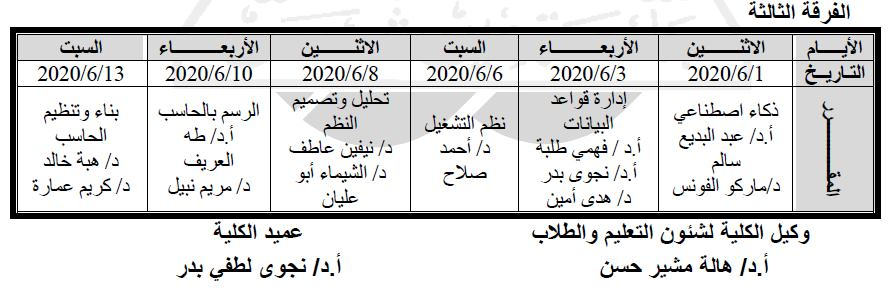

scientific research
===================

1. choose best research subject
    - more genaric more simplest
2. information gathering from trusted resources
3. how to writing scientific research
    - elements of research:
        1. Title
        2. Elements
        3. Itroduction
        4. Body
        5. Summary/Conclusion
        6. Reference [Citation - doi]
            - Egyption Knowledge Bank
            - Google Scholar
            - pubmed
4. how to avoid plagiarism

# helping tools:
- grammarly extention
- search at google: <artical rewite>
    - https://quillbot.com
    - essaybot

| Subject | Version | DeadLine | Title                                                                        |
|---------|---------|----------|------------------------------------------------------------------------------|
| AI      | 2       | 1        | Clustering, Gaming and Search                                                |
| DB      | 1       | 3        | Enhanced entity-relationship diagram (EERD) and mapping-to-schema case study |
| OS      | B       | 6        | The Buffering Effect on the Page Replacement under MLFQ Scheduler            |
| SA      | 4       | 8        | Food Recommender System                                                      |
| Graphic | 2       | 10       | Applying Advanced Rendering Techniques in Animation Production               |
| Arch    | 3       | 13       | Implement a MIPS Emulator                                                    |

# link

[drive](https://drive.google.com/drive/folders/1vfQqUDsFzCDLSX3vegQ7kS2I0N2tLzf0)

# dwonload list
- [] https://www.youtube.com/playlist?list=PLyzOVJj3bHQuiujH1lpn8cA9dsyulbYRv

C:\Users\Mostafa ALzahar\AppData\Local\VirtualStore

Artifical Antiigance (AI)
=========================

| Algorithm                | Project  |
|--------------------------|----------|
| Depth-first search (DFS) | Maze     |
| the Alpha–beta (gaming)  | connect4 | pygame
| K-means                  |          |